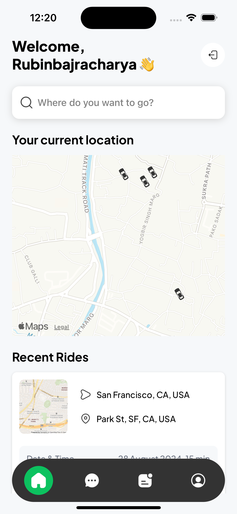
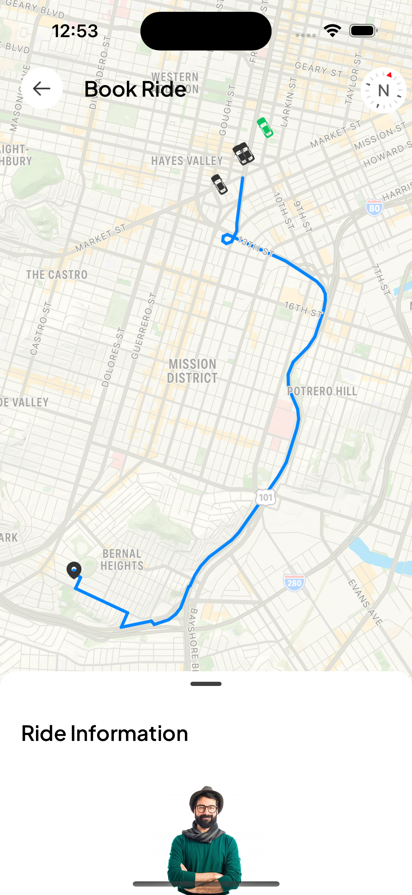
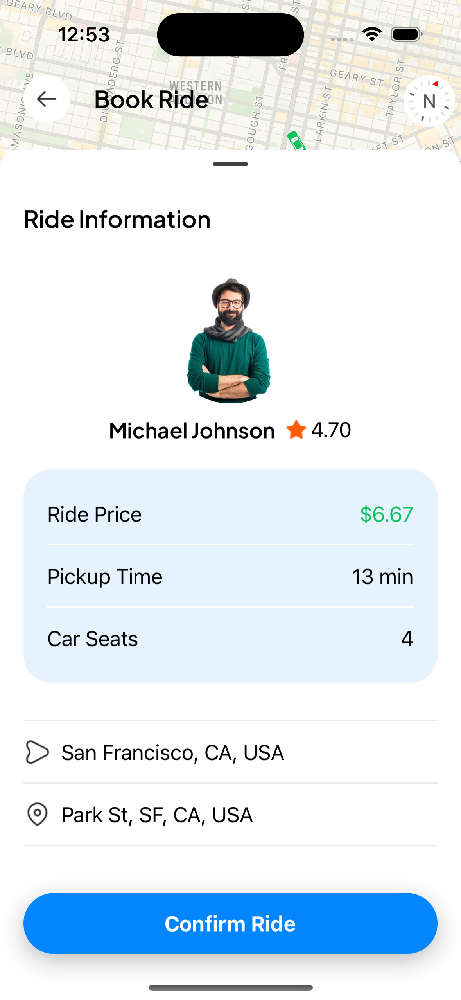
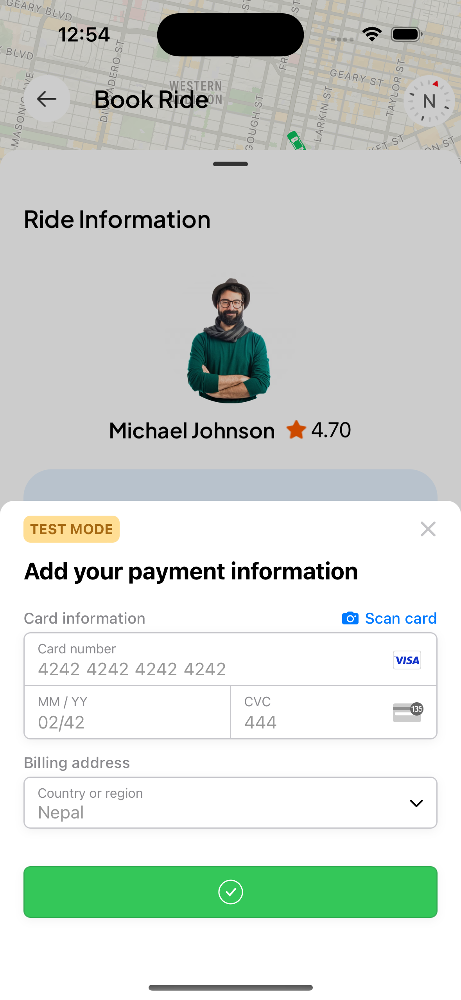

# Ryde (Uber Clone)

This is a sample application to demonstrate how to build a Uber clone using React Native using Expo, Clerk, Nativewind ...

Until Now we have created routing logic, Sample Screens as per the flow. Below you can see the screenshots of the application up until now.

## Screenshots

 
 
 
 
 
 
 
 
 
 
 
 
 
 
 
 
 
 
 
 

**Final Commit added ...**
